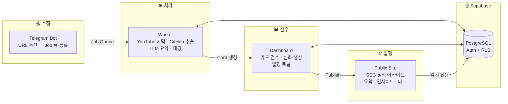

<div align="center">

# zettlink

**URL을 던지면 지식이 쌓인다**

YouTube·GitHub 링크를 Telegram으로 던지기만 하면<br>
AI가 요약·태그·인사이트를 자동 생성합니다.<br>
검수 후 한 번의 클릭으로 공개 아카이브에 발행하는, 1인 지식관리 파이프라인.

[Live Site →](https://zettlink-site.vercel.app/)

</div>

---

## Overview

zettlink는 **수집 → 처리 → 검수 → 발행**의 4단계로 구성된 풀스택 지식관리 시스템입니다.



## Tech Stack

| Layer | Technology |
|---|---|
| **Monorepo** | pnpm workspaces |
| **Frontend** | Next.js 15 (App Router), React 19, Tailwind CSS 4 |
| **Backend** | Next.js Route Handlers (API), Node.js (Bot/Worker) |
| **Database** | Supabase (PostgreSQL + Auth + Row Level Security) |
| **AI/LLM** | Claude Sonnet 4.6 (심화 생성), OpenRouter (요약/태깅) |
| **Infra** | Vercel (Site), 로컬 데몬 (Bot/Worker) |
| **Design System** | Semantic token 기반 커스텀 시스템 (Pretendard, sky+orange 팔레트) |
| **Search** | Pagefind (정적 사이트 풀텍스트 검색) |
| **Language** | TypeScript (Strict), Zod (런타임 검증) |

## Project Structure

```
zettlink/
├── apps/
│   ├── bot/             # Telegram Bot — URL 수신 → jobs 테이블 INSERT
│   ├── worker/          # Job 큐 폴링 → YouTube 자막/GitHub 추출 → LLM 요약 → DB 저장
│   ├── dashboard/       # Admin Dashboard — 카드 검수, 심화 콘텐츠 생성, 발행 관리
│   └── site/            # Public Site — SSG 정적 아카이브 (Vercel 배포)
├── packages/
│   ├── db/              # Supabase 클라이언트 (browser/server 분리)
│   ├── shared/          # 환경변수 검증 (Zod), 공통 설정
│   └── ui/              # 공유 UI 컴포넌트 (Badge, Button, CardRow, Tag)
├── supabase/            # DB 마이그레이션, 시드 데이터, RLS 정책
└── vault/               # 로컬 마크다운 아카이브 (자막, 추출문, 심화 콘텐츠)
```

## Key Features

### 🤖 자동 수집 파이프라인
- Telegram 메시지로 URL 전송 → 자동 큐 등록
- YouTube: 자막 추출 → LLM 요약·인사이트·태그 자동 생성
- GitHub: README/소스 추출 → 프로젝트 분석·태깅
- 재시도 로직 (최대 3회) + 실패 시 dead 상태 전환

### 📊 Admin Dashboard
- Supabase Auth 기반 관리자 인증 (UUID 화이트리스트)
- 카드 목록 그리드 + 태그/상태 필터링
- 1-click 심화 콘텐츠 생성 (Deep Dive / TIL / Guide)
- Claude Sonnet 4.6 직접 호출 + 비용 추적
- 일일 예산 가드 ($5 기본) — 초과 시 작업 자동 중단

### 🌐 Public Site
- Next.js SSG (`output: 'export'`) → Vercel 정적 배포
- 카드 상세 페이지: 요약, 인사이트, 심화 분석, TIL, 실용 가이드
- Pagefind 풀텍스트 검색
- 태그 기반 탐색
- 라이트/다크 모드 (next-themes)
- 반응형 디자인

### 🛡️ 안전장치
- LLM 비용 가드: 일일/건당 예산 상한, 초과 시 Telegram 알림
- Vault atomic write: temp → rename 패턴으로 중간 크래시 방지
- RLS: 공개 사이트는 `published=true` 카드만 조회 가능
- Zod 스키마 검증: 환경변수 누락 시 앱 시작 차단

## Database Schema

```
cards ──┤ id, url, platform, title, summary, insights(jsonb)
        │ has_deep, has_til, has_guide, deep_content, til_content, guide_content
        │ status(pending/processing/done/failed), published, vault_path
        │ tokens_used, cost_usd
        │
tags  ──┤ canonical_name, aliases(jsonb), usage_count
        │
card_tags ── card_id ↔ tag_id (M:N)
        │
jobs  ──┤ raw_url, status(queued/processing/done/failed/dead)
        │ attempts, max_attempts, force, telegram_chat/msg
        │
events ─┤ type(llm.call/enrich.done/budget.exceeded/...)
        │ level, card_id, data(jsonb)
```

## Design System

Semantic token 기반으로 구축된 커스텀 디자인 시스템:

- **Color**: Atomic(sky·orange·slate) → Semantic(`primary.normal`, `accent.normal` 등) 2단계
- **Typography**: Pretendard 폰트, display1~caption2까지 14단계 타입 스케일
- **Elevation**: 5단계 그림자 토큰 (xsmall → xlarge)
- **Theme**: CSS 변수 기반 Light/Dark 자동 전환

## Getting Started

### Prerequisites
- Node.js ≥ 22
- pnpm ≥ 9
- Supabase 프로젝트 (PostgreSQL + Auth)

### Setup

```bash
# 의존성 설치
pnpm install

# 환경변수 설정
cp .env.example .env
# .env 파일에 Supabase, Telegram, LLM API 키 입력

# DB 마이그레이션
npx supabase db push

# 개발 서버 실행 (Bot + Worker + Dashboard + Site 동시 기동)
npm run dev
```

### Ports

| App | Port | URL |
|---|---|---|
| Dashboard | 3001 | http://localhost:3001 |
| Site | 3002 | http://localhost:3002 |

## License

[MIT](LICENSE)
